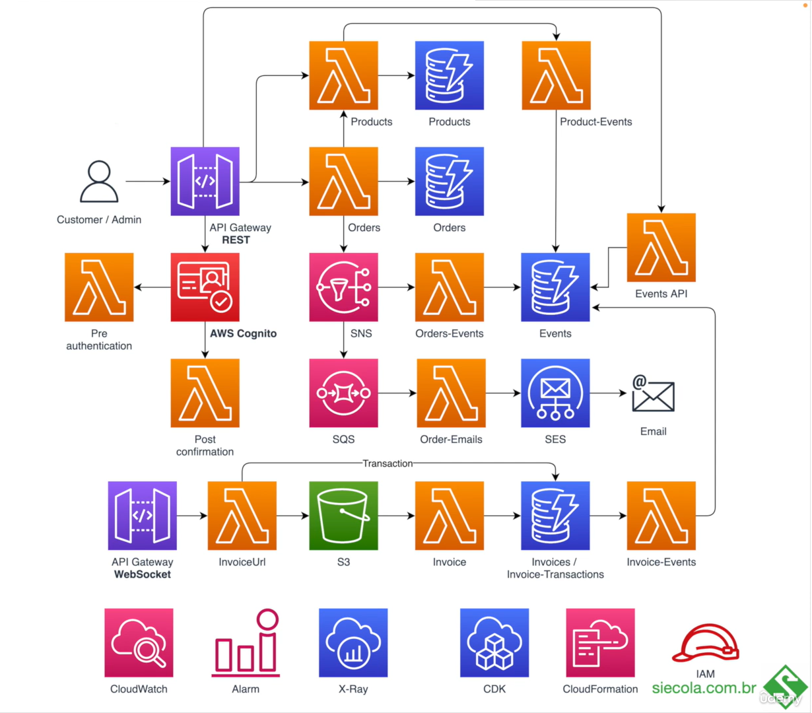

<h1 align="center">E-commerce API REST: AWS CDK TypeScript project</h1>

## ℹ️About
This project was developed during the "AWS Serverless com Typescript e AWS Cloud Development Kit" course from Udemy.

## 📷 Architecture of the project:

 

## 🔗Documentation:

## 🌐 Deploy

## ☑️Requests:

## 💻 Technologies:
- Typescript
- Node.js
- AWS Lambda
- AWS API Gateway (REST)
- AWS Cloud Watch
- AWS X-Ray
- DynamoDB
- AWS Cloud Development Kit (CDK)

